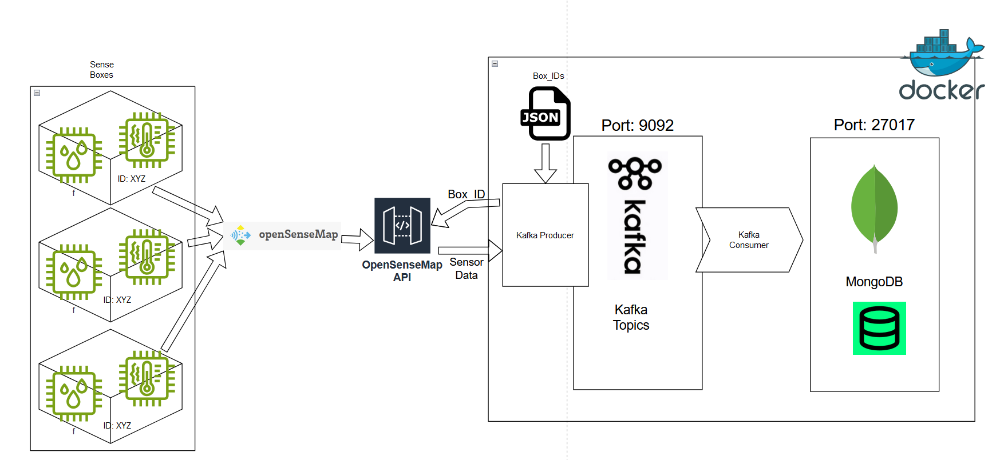

# Project Title

## Project Overview
This project is a containerized application that processes sensor data using Kafka and stores it in MongoDB for further analysis.




## Prerequisites
- [Docker](https://www.docker.com/)
- [Docker Compose](https://docs.docker.com/compose/)
- Python 3.x with packages: `kafka-python`, `pymongo`

## Setup Instructions

### Clone the Repository
```
git clone https://github.com/TomTec94/project_Data_Eng.git
cd project_Data_Eng
````
## Build and Start the Docker Containers

### Build the containers:
```bash
docker-compose build
```

### Start the containers:
```bash
docker-compose up
```

## Check Logs

I recommand to use tools like Portainer oder Docker Desktop for easy monitoring and container maintance
But of course feel free to use the basic commands in a System prompt like PowerShell

### Check running container
```bash
docker ps
```

### Producer Logs:
```bash
docker-compose logs producer
```

### Consumer Logs:
```bash
docker-compose logs consumer
```

### Kafka Logs:
```bash
docker-compose logs kafka
```

### MongoDB Logs:
```bash
docker-compose logs mongodb
```

## Running the Pipeline

To start the full data pipeline, simply run:
```bash
docker-compose up
```

## Troubleshooting Tips

- **NoBrokersAvailable**: Ensure Kafka is running and the correct port is exposed.
- **MongoDB Connection Issues**: Check the connection string and verify MongoDB container is up.

## Configuration Details

- **Environment Variables**: Configure any required environment variables within `docker-compose.yml`. if needed
- **Kafka Topics & Box IDs**: Adjust in the code or configuration files as needed.
- **Add/change Box IDs**: To add, delete or change the boxes from where the system retrieve the sensor data, change the needed box IDs in the JSON file
 ```bash
    project_Data_Eng/producer/box_ids.json
```


**Get Box ID: 
- go to https://opensensemap.org/

- chose an Sensorbox:
- click on further Box information:
- 
- retrieve the Box ID:
- 
- Add it to the JSON list

## Next Steps for Use

- **Querying MongoDB**: Use MongoDB shell or any client to query the `sensor_database` for stored data.
- For quick Database insights you can use a build in Database module in your IDE (like the Mongo-DB module in PyCharm)
- 
- **Potential Extensions**:
  - Visualization of the data using tools like Grafana.
  - Data analysis and reporting using Python or BI tools.
